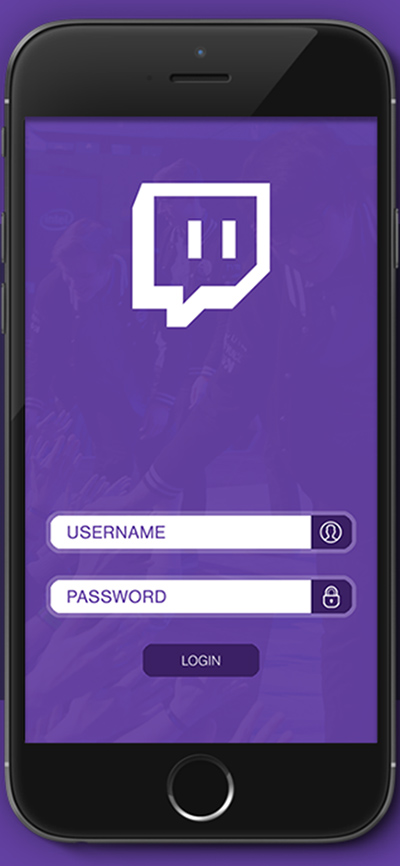
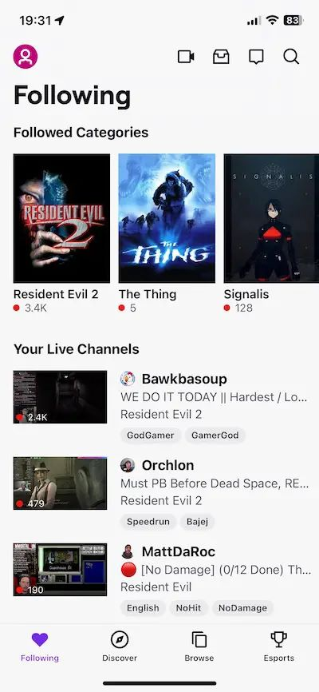
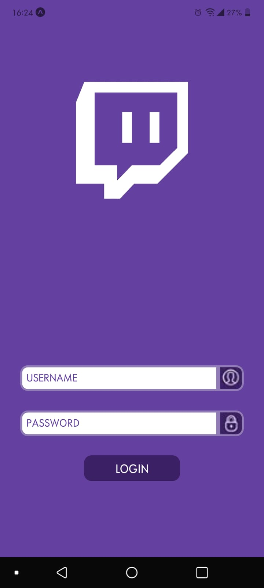
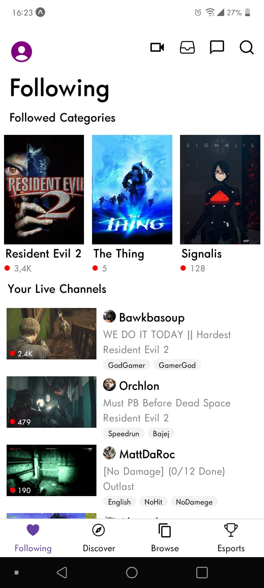

# clone-twitch

Neste projeto, escolhi clonar o aplicativo Twitch TV. Foi desafiador pois este app é repleto de pequenos e grandes detalhes, além de nunca ter tido experiência alguma com React Native, porém dei o melhor de mim e fiquei bastante satisfeita com o resultado. 

Após baixar o repositório, rodar `npm i` para instalar as dependências.
#
# Modelos: 

 

#

# Resultados:

